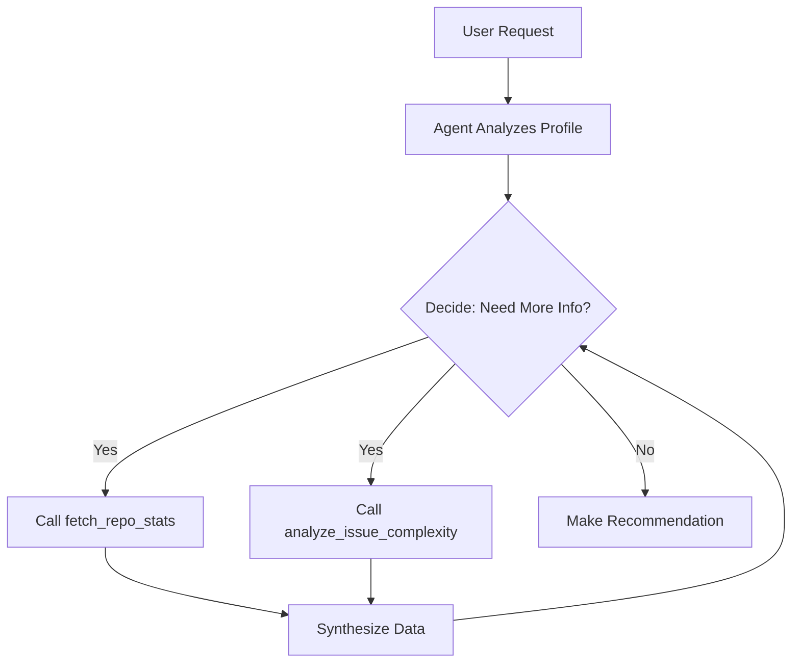

# Agentic AI Architecture

## Issue Recommender Agent

### Design Philosophy
Rather than relying solely on LLM knowledge, our agent actively investigates repositories and issues using real-time data to make informed recommendations.

### Multi-Step Reasoning Flow

### Tool Usage Patterns

Observed in Opik traces:
- Average tool calls per recommendation: X
- Most common pattern: fetch_repo_stats → analyze_issue_complexity → recommendation
- Tool selection accuracy: X%

### Hierarchical Tracing

All agent activities are traced in Opik with parent-child relationships:
- **Parent trace**: Complete agent workflow
- **Child LLM calls**: Each reasoning step
- **Tool spans**: Individual tool executions

This enables analysis of agent efficiency and decision quality.