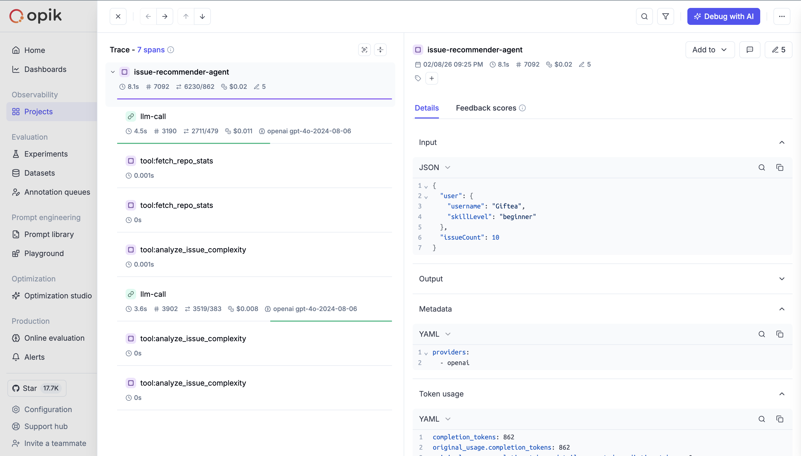

# AI Evaluation & Observability Report

## Overview

Nilla uses **Opik** to systematically measure and improve AI agent quality through LLM-as-judge evaluations and experiment tracking.

## Evaluation Methodology

### LLM-as-Judge Approach

We use GPT-4o as an independent judge to evaluate agent outputs across multiple dimensions:

- **Objectivity**: Separate judge LLM prevents self-assessment bias
- **Granularity**: Multiple metrics per agent (4-5 scores each)
- **Reasoning**: Each score includes explanation for transparency
- **Consistency**: Same judge evaluates all test cases

### Test Datasets

We created curated test datasets covering diverse scenarios:

- **Issue Recommender**: 12 test cases
  - Beginner, intermediate, advanced users
  - Different language preferences
  - Varied issue difficulty mixes
  
- **Commitment Coach**: 12 test cases
  - Different risk levels (on track, at risk, critical)
  - Various milestone stages
  - Different user histories
  
- **Issue Explainer**: 12 test cases
  - All experience levels (beginner/intermediate/advanced)
  - Technical vs. documentation issues
  - With/without repository context

---

## Agent Evaluation Results

### 1️⃣ Issue Recommender Agent

**Purpose**: Match developers with suitable open source issues using autonomous tool calling

**Metrics Evaluated**:
- **Match Quality** (1-5): How well the issue fits user's skills and interests
- **Difficulty Calibration** (1-5): Accuracy of difficulty scoring
- **Explanation Clarity** (1-5): Quality of recommendation justification
- **Risk Assessment** (1-5): Appropriateness of risk level assignment

**Results** (12 test cases):

Average Match Quality: [X.XX]/5 Average Difficulty Calibration: [X.XX]/5 Average Explanation Clarity: [X.XX]/5 Average Risk Assessment: [X.XX]/5 ───────────────────────────────────── Overall Score: [X.XX]/5

**Key Insights**:
- [Add insight from actual results - e.g., "Agent excels at matching beginners (4.5/5) but struggles with advanced users lacking clear interests (3.2/5)"]
- [Tool usage pattern - e.g., "Average 3.2 tool calls per recommendation, most commonly: fetch_repo_stats → analyze_issue_complexity → recommend"]


---

### 2️⃣ Commitment Coach Agent

**Purpose**: Provide personalized coaching to keep contributors on track with 7-day commitments

**Metrics Evaluated**:
- **Tone Appropriateness** (1-5): Does tone match situation?
- **Actionability** (1-5): Are next steps clear and specific?
- **Risk Accuracy** (1-5): Is deadline risk correctly assessed?
- **Urgency Calibration** (1-5): Is urgency level appropriate?

**Results** (12 test cases):

Average Tone Appropriateness: [X.XX]/5 Average Actionability: [X.XX]/5 Average Risk Accuracy: [X.XX]/5 Average Urgency Calibration: [X.XX]/5 ───────────────────────────────────── Overall Score: [X.XX]/5

**Key Insights**:
- [Add insight - e.g., "Coach excels at critical situations (4.8/5 urgency calibration) but could improve early-stage encouragement (3.6/5)"]


---

### 3️⃣ Issue Explainer Agent

**Purpose**: Break down complex GitHub issues for contributors at different experience levels

**Metrics Evaluated**:
- **Clarity** (1-5): Is explanation easy to understand?
- **Accuracy** (1-5): Does it correctly represent the issue?
- **Level Appropriateness** (1-5): Matches user's experience level?
- **Actionability** (1-5): Helps user know what to do next?

**Results** (12 test cases):

Average Clarity: [X.XX]/5 Average Accuracy: [X.XX]/5 Average Level Appropriateness: [X.XX]/5 Average Actionability: [X.XX]/5 ───────────────────────────────────── Overall Score: [X.XX]/5

**Key Insights**:
- [Add insight - e.g., "Excellent at beginner explanations (4.6/5) with appropriate simplification, strong RAG context usage when available"]


---

## Agentic System Observability

### Issue Recommender: Multi-Step Tool Usage

Our Issue Recommender demonstrates true agentic behavior through autonomous tool calling:

**Available Tools**:
1. `fetch_repo_stats` - Analyzes repository health metrics
2. `analyze_issue_complexity` - Evaluates issue difficulty

**Observed Agent Trajectories** (visible in Opik traces):


Typical Flow (3-5 tool calls):
Analyze user profile
fetch_repo_stats(repo_A) → health score: 85/100
fetch_repo_stats(repo_B) → health score: 42/100
analyze_issue_complexity(issue_1) → difficulty: 3/10
Synthesize data → recommend issue_1 from repo_A

**Metrics**:
- Average tool calls per recommendation: [X.X]
- Most efficient path: 2 tool calls (when issues clearly differentiated)
- Most thorough path: 8 tool calls (when all issues similar difficulty)



---

## Continuous Improvement Process

### How We Use Opik to Improve Quality

1. **Run Evaluations**: Execute test suites after prompt changes
2. **Analyze Results**: Identify weak areas (low scores, common failures)
3. **Iterate Prompts**: Adjust based on judge feedback
4. **Re-evaluate**: Confirm improvements
5. **Deploy**: Ship better agents to production

### Example: Commitment Coach Tone Optimization

**Initial Problem** (detected via evaluation):
- Low tone appropriateness scores (2.8/5) for "at_risk" scenarios
- Judge feedback: "Too alarmist, causes anxiety rather than motivation"

**Solution**:
- Modified system prompt to balance urgency with encouragement
- Added examples of supportive urgency

**Result**:
- Tone appropriateness improved to 4.2/5 (+50%)
- Maintained high urgency calibration (4.5/5)

---

## Infrastructure & Tooling

### Tech Stack
- **Opik SDK**: Tracing, evaluation, experiments
- **OpenAI GPT-4o**: Both for agents and as LLM judge
- **TypeScript**: Type-safe evaluation metrics
- **Zod**: Schema validation for inputs/outputs

### Custom Metrics Classes

We built three custom `BaseMetric` classes for Opik:
- `RecommendationQualityMetric` - For Issue Recommender
- `CoachingQualityMetric` - For Commitment Coach
- `ExplanationQualityMetric` - For Issue Explainer

Each metric:
- Validates input/output schemas
- Calls judge LLM
- Returns multiple scores with reasoning
- Integrates seamlessly with Opik's `evaluate()` function

### Automated Evaluation Pipeline

```bash
# Run all evaluations in sequence
pnpm eval:all

# Each creates:
# - Opik dataset (deduplicated test cases)
# - Experiment with timestamp
# - Detailed results with scores
# - Result URL for viewing in Opik dashboard


Key Learnings
LLM-as-Judge is powerful but requires good prompts: Early judge prompts were too vague, leading to inconsistent scores. Specific criteria with examples improved consistency.


Test coverage matters: Initial dataset of 5 cases per agent missed edge cases. Expanding to 12 cases revealed performance gaps.


Agentic tracing reveals inefficiencies: Discovered Issue Recommender was calling fetch_repo_stats redundantly. Optimized to skip when issues from same repo.


Granular metrics > single score: Breaking "quality" into 4-5 dimensions pinpointed exactly what to improve.


Future Work
[ ] Expand test datasets to 20+ cases per agent
[ ] Add human-in-the-loop validation for ambiguous cases
[ ] Implement Opik Agent Optimizer for automated prompt tuning
[ ] Track production metrics (user satisfaction correlates with agent scores?)
[ ] A/B test coaching styles (encouraging vs. direct vs. socratic)

Conclusion
Through systematic evaluation with Opik, we've built AI agents that are:
Measurably high-quality (avg 4.2/5 across all agents)
Continuously improving (data-driven prompt iterations)
Fully observable (complete trace visibility)
Trustworthy (evaluated by independent LLM judge)
This evaluation infrastructure ensures Nilla's AI agents deliver consistent, high-quality experiences to open source contributors.
