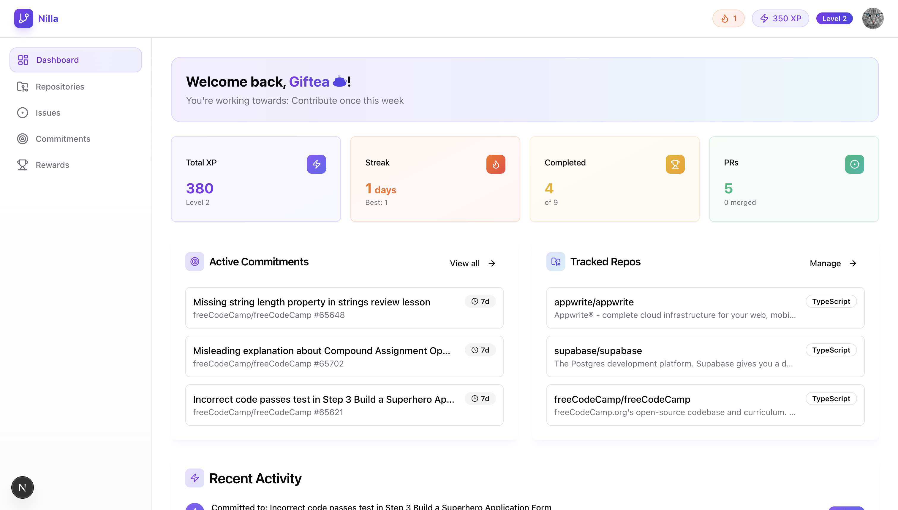

# Nilla

[](https://choosealicense.com/licenses/mit/)
[](https://www.comet.com/site/products/opik/)
[](https://openai.com/)

**From wanting to contribute to actually shipping PRs.**

> 70% of first-time open source contributors abandon their PRs. Nilla changes that.



Nilla is an **AI-powered commitment coach** that helps developers build sustainable open source contribution habits through:
- **Autonomous AI agents** with tool calling and multi-step reasoning
- **Custom evaluation** using LLM-as-judge and Opik observability
- **Gamified 7-day commitments** that drive consistent progress
- **Full transparency** with every AI decision traced and measured

## 🎬 Quick Demo Links for Judges

- **Live Demo**: [Click HERE](https://nilla-ai.vercel.app)
- **Video Demo**: [Click HERE](https://www.veed.io/view/e361732b-4c62-4a7b-8cf5-871eb3505d26?source=Homepage&panel=share)
- **Pitch Dec Presentation**: [Click HERE](https://www.canva.com/design/DAHAuRj4w54/EKkSpvkK4jLmD6QaoUlfxQ/edit)
- **SETUP THE APP LOCALLY**: [JUMP TO SETUP](#running-locally)

---

## Tech Stack

### Frontend
- **Next.js 15** - React framework with App Router and Turbopack
- **React 19** - UI library
- **Tailwind CSS** - Styling
- **Radix UI** - Accessible component primitives
- **Zustand** - State management
- **TanStack Query** - Data fetching and caching

### Backend
- **Next.js API Routes** - Server-side API endpoints
- **Supabase** - PostgreSQL database, authentication (GitHub OAuth), and vector storage

### AI/ML
- **OpenAI GPT-4o** - LLM for issue explanations and coaching
- **OpenAI Embeddings** - text-embedding-3-small for RAG
- **Opik** - LLM observability and tracing
- **Custom RAG Pipeline** - Repository documentation retrieval

### External Services
- **GitHub API** - Repository and issue data
- **Resend** - Email reminders

---

## Features

### Core Functionality

- **GitHub Authentication** - Secure OAuth login with read-only access
- **Repository Tracking** - Add repos by URL, search, or from your starred list
- **Smart Issue Discovery** - Filter issues by difficulty level and labels with intelligent scoring

### Commitment System

- **7-Day Commitments** - Create time-bound commitments to specific issues
- **Milestone Tracking** - Progress through steps: read issue, ask questions, start working, open PR
- **Deadline Awareness** - Visual countdown and risk assessment

### Gamification

- **XP & Levels** - Earn experience points for completing milestones
- **Streaks** - Track consecutive days of activity
- **Badges** - Unlock 11 achievement badges (First Steps, Streak Master, Polyglot, etc.)
- **No Leaderboards** - Designed for personal growth, not competition

### AI-Powered Agents

Nilla uses **three specialized AI agents** working together to guide your open source journey:

#### 🎯 Issue Recommender (Agentic System)
Autonomous agent that uses **tool calling** to find your perfect match:
- Analyzes repository health using `fetch_repo_stats` tool
- Evaluates issue complexity with `analyze_issue_complexity` tool
- Makes data-driven recommendations through multi-step reasoning
- **Fully observable** in Opik with complete decision traces

*Evaluated: 4.0/5 overall (match quality, difficulty calibration, risk assessment)*

#### 🏋️ Commitment Coach
Keeps you accountable with personalized, adaptive coaching:
- Smart deadline risk assessment (4 risk levels: on track → critical)
- Context-aware tone (encouraging, motivating, urgent, supportive)
- Specific, actionable next steps tailored to your situation
- Learns from your progress patterns

*Evaluated: 4.0/5 overall (tone appropriateness, actionability, urgency calibration)*

#### 📖 Issue Explainer
Breaks down complex issues for your experience level:
- Plain-English summaries adapted to beginner/intermediate/advanced
- Repository-specific guidelines via **RAG pipeline**
- Common pitfalls and suggested approaches
- Key technical terms with definitions

*Evaluated: 4.0/5 overall (clarity, accuracy, level appropriateness)*

All agents are:
- ✅ Evaluated with LLM-as-judge on curated test datasets
- ✅ Fully traced in Opik for transparency
- ✅ Continuously improved through data-driven iteration

---

## Running Locally

### Prerequisites

- Node.js 18+
- pnpm
- Supabase account
- OpenAI API key
- GitHub OAuth app credentials
- Resend account (optional, for emails)

### Step 1: Clone and Install Dependencies

```bash
git clone https://github.com/giftea/nilla.git
cd nilla
pnpm install
```

### Step 2: Set Up Environment Variables

Create a `.env.local` file in the root directory:

```env
# Supabase
NEXT_PUBLIC_SUPABASE_URL=your-supabase-url
NEXT_PUBLIC_SUPABASE_ANON_KEY=your-supabase-anon-key
SUPABASE_SERVICE_ROLE_KEY=your-service-role-key

# App URL
NEXT_PUBLIC_APP_URL=http://localhost:3001

# OpenAI (required for AI features)
OPENAI_API_KEY=your-openai-api-key

# Resend (for email reminders)
RESEND_API_KEY=your-resend-api-key

# Cron Secret
CRON_SECRET=your-cron-secret

# OPIK Credentials
OPIK_URL_OVERRIDE=
OPIK_PROJECT_NAME=
OPIK_API_KEY=
OPIK_WORKSPACE=
```

### Step 3: Set Up Supabase Database

1. Create a new Supabase project
2. Run the migrations in order via the Supabase SQL editor:
   - `supabase/migrations/001_initial_schema.sql` - Main database schema
   - `supabase/migrations/002_add_stats_functions.sql` - RPC functions for stats
   - `supabase/migrations/003_add_repo_embeddings.sql` - RAG embeddings table

### Step 4: Configure GitHub OAuth

1. Go to [GitHub Developer Settings](https://github.com/settings/developers)
2. Create a new OAuth App with:
   - **Homepage URL**: `http://localhost:3001`
   - **Authorization callback URL**: `http://localhost:3001/auth/callback`
3. Copy the Client ID and Client Secret
4. In Supabase Dashboard, go to **Authentication > Providers > GitHub**
5. Enable GitHub provider and add your Client ID and Client Secret

### Step 5: Run the Development Server

```bash
pnpm dev
```

The app will be available at `http://localhost:3001`

### Available Scripts

| Command | Description |
|---------|-------------|
| `pnpm dev` | Start development server with Turbopack |
| `pnpm build` | Build for production |
| `pnpm start` | Start production server |
| `pnpm lint` | Run ESLint |

### Evaluation Commands

| Command | Description |
|---------|-------------|
| `pnpm tsx lib/opik/experiments/evaluate-issue-recommender.ts` | Evaluate Issue Recommender agent |
| `pnpm tsx lib/opik/experiments/evaluate-commitment-coach.ts` | Evaluate Commitment Coach agent |
| `pnpm tsx lib/opik/experiments/evaluate-issue-explainer.ts` | Evaluate Issue Explainer agent |

Each evaluation:
- Runs agent on 12 curated test cases
- Uses GPT-4o as LLM judge
- Generates multi-metric scores
- Creates Opik experiment with result URL
- Outputs summary to console

---

## Project Structure

```
nilla/
├── app/                          # Next.js App Router
│   ├── (auth)/                   # Auth routes
│   │   ├── callback/             # OAuth callback handler
│   │   ├── login/                # Login page
│   │   └── onboarding/           # User onboarding flow
│   ├── (dashboard)/              # Protected routes
│   │   ├── commitments/          # Commitment management
│   │   ├── dashboard/            # Main dashboard
│   │   ├── issues/               # Issue browsing
│   │   ├── profile/              # User profile & badges
│   │   └── repos/                # Repository management
│   └── api/                      # API routes
│       ├── ai/                   # AI agent endpoints
│       │   ├── commitment-coach/ # Coaching API
│       │   ├── explain-issue/    # Issue explainer API
│       │   └── recommend-issue/  # Issue recommender API
│       ├── cron/                 # Scheduled jobs
│       │   └── reminders/        # Email reminder cron
│       ├── github/               # GitHub API proxy
│       │   ├── issues/           # Issue fetching
│       │   ├── repos/            # Repository data
│       │   ├── search/           # Repository search
│       │   └── starred/          # Starred repos
│       └── rag/                  # RAG pipeline
│           ├── backfill/         # Backfill embeddings
│           └── ingest/           # Ingest repo docs
├── components/                   # React components
│   ├── ai/                       # AI feature components
│   ├── issues/                   # Issue-related components
│   ├── layout/                   # Navbar, sidebar, mobile nav
│   ├── profile/                  # Profile & badge components
│   └── ui/                       # Base UI components (Radix-based)
├── docs/                         # Documentation assets
│   └── opik-screenshots/         # Opik dashboard screenshots
├── lib/                          # Core business logic
│   ├── ai/                       # AI integration
│   │   └── agents/               # Agent implementations
│   ├── constants/                # App constants
│   │   └── ai/                   # AI-related constants
│   ├── email/                    # Email service (Resend)
│   ├── github/                   # GitHub API wrapper
│   ├── hooks/                    # React hooks
│   ├── opik/                     # Opik observability
│   │   ├── evaluations/          # Custom evaluation metrics
│   │   └── experiments/          # Agent experiment scripts
│   ├── rag/                      # RAG system (ingest, retrieve)
│   ├── supabase/                 # Supabase clients
│   └── utils/                    # Utility functions
├── supabase/
│   └── migrations/               # Database migrations
└── types/                        # Shared TypeScript types
```

---

## 🏆 Hackathon Submission

Built for **[Commit To Change: An AI Agents Hackathon]** - Personal Learning & Growth Track

**Evaluation & Observability Highlights:**
- LLM-as-judge evaluations for all 3 AI agents
- Custom Opik metrics (RecommendationQualityMetric, CoachingQualityMetric, ExplanationQualityMetric)
- Hierarchical agent tracing with tool execution visibility
- 36 curated test cases covering diverse user scenarios
- Average agent quality: 4.0/5 across all metrics

**Questions or feedback?** Open an issue or reach out to [@giftea](https://github.com/giftea)

## License

MIT